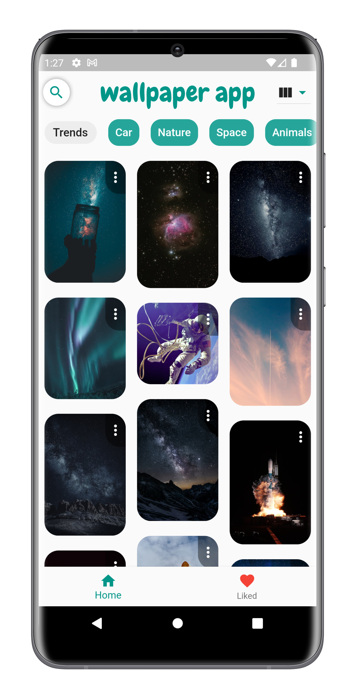

<!-- PROJECT LOGO -->
<br />
<div align="center">
  <a href="https://github.com/othneildrew/Best-README-Template">
    
  </a>
  <h2 align="center">Flutter Wallpaper App</h3>
  
</div>

[![LinkedIn][play-store]][play-store-url]

[![LinkedIn][linkedin-shield]][linkedin-url]

<div align="center">
    
</div>

## Prerequisites

- Get a free API Key at https://www.pexels.com/api/
- Enter your [Pexels](https://www.pexels.com/api/) API in

1. `lib/services/wallpaper_api.dart`

   ```dart
   var result = await http.get(
       Uri.parse(
           "https://api.pexels.com/v1/curated?per_page=80&orientation=portrait"),
       headers: {
         'Authorization': '//YOUR API KEY//',
       },
     );
   ```

2. `lib/services/search.dart`
   ```dart
    var result = await http.get(
     Uri.parse(
         "https://api.pexels.com/v1/search?query=$value&per_page=80&orientation=portrait"),
     headers: {
       'Authorization': '//YOUR API KEY//',
     });
   ```

## Usage

1.  ```sh
    flutter pub get
    ```

1.  ```sh
    flutter run
    ```

[linkedin-shield]: https://img.shields.io/badge/-LinkedIn-black.svg?style=for-the-badge&logo=linkedin&colorB=555
[linkedin-url]: https://www.linkedin.com/in/baranzengeralp/
[flutter]: https://img.shields.io/badge/flutter-blue?style=for-the-badge&logo=flutter
[flutter-url]: https://flutter.dev/
[play-store]: https://img.shields.io/badge/Play%20store-green?style=for-the-badge&logo=google-play
[play-store-url]: https://play.google.com/store/apps/details?id=com.baranzengeralp
